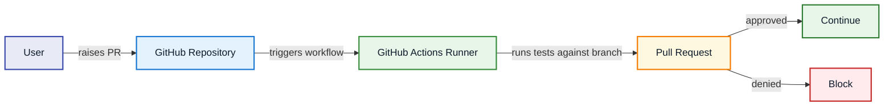

# Purpose

This is a DevOps project. It focuses on the CI/CD and infrastructure around a frontend microservice. 

# Summary
This project contains: 
- **Automated testing on every PR** — Cypress E2E tests run in CI before code can merge
- **Version Bumping** - Once merged the version is bumped, helping keep code straight
- **Containerized deployment** — Docker image built and pushed to ECR on merge
- **Infrastructure as code** — EC2 hosting, networking, and ECR provisioned with Terraform
- **One-click deploys** — manually triggered workflow pulls the latest image and restarts the container in aws

# Technologies
| Technology | Role |
|---|---|
| Cypress | E2E testing |
| Docker | Containerization |
| GitHub Actions | CI/CD pipelines |
| Terraform | Infrastructure as code |
| ECR | Image registry |
| EC2 | Hosting |

# Local development

```bash
cd frontend

npm install          # install dependencies
npm run dev          # start dev server
npm run lint         # lint
npm run format       # autoformat

# containerized
docker build -t snippets .
docker run -p 8080:8080 snippets

# e2e tests
npm run cypress run
```

# CI/CD

### Raised PR 
workflow file: [`ci.yaml`](.github/workflows/ci.yaml)


### On Merge 
workflow file: [`build.yaml`](.github/workflows/build.yaml)


### Trigger Deployment
workflow file: [`deploy.yaml`](.github/workflows/deploy.yaml)
```mermaid
flowchart LR
  U[User] -->|manually triggers deploy workflow| RUN[GitHub Actions Runner]
  RUN -->|instructs snippets server to pull latest image and restart container| EC2[EC2 Server] 

  style U    fill:#E8EAF6,stroke:#3949AB,stroke-width:2px,color:#0D1B2A
  style RUN  fill:#E8F5E9,stroke:#388E3C,stroke-width:2px,color:#0D1B2A
  style EC2  fill:#E3F2FD,stroke:#1976D2,stroke-width:2px,color:#0D1B2A
  ```

# Cloud Infrastructure

Managed with Terraform in [`terraform/`](terraform/).

```mermaid
flowchart LR
  ECR[ECR] -->|pull image| Docker[Docker on EC2]
  Docker -->|serves frontend| U[User]

  style ECR    fill:#FFF8E1,stroke:#F57C00,stroke-width:2px,color:#0D1B2A
  style Docker fill:#E3F2FD,stroke:#1976D2,stroke-width:2px,color:#0D1B2A
  style U      fill:#E8EAF6,stroke:#3949AB,stroke-width:2px,color:#0D1B2A
```