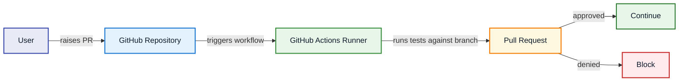

# Purpose

This is a DevOps project. A complex application with many developers working on it needs a way to make quick, reliable changes. This project uses DevOps mentality and techniques to solve that problem for a microservice in an arbitrary CRUD application. 

# Technologies Used
- Terraform, AWS (ECR, EC2), Docker, Cypress, React, Github Actions


This project contains:
- the local development environment for a frontend microservice.
- containerization of the application with docker
- good coding practices such as linting/autoformatting/version control. 
- a github action to run cypress tests against the service in order to help validate a pr
- github actions to build/test/deploy the resulting docker image to AWS ECR 
- github action to stop the old container, pull the new one from ECR, and start it.
- Terraform to source control the EC2 instance hosting the application. 

# Diagram

[`ci.yaml`](.github/workflows/ci.yaml)


[`build.yaml`](.github/workflows/build.yaml)


[`deploy.yaml`](.github/workflows/deploy.yaml)
```mermaid
flowchart LR
  U[User] -->|manually triggers deploy workflow| RUN[GitHub Actions Runner]
  RUN -->|instructs snippets server to pull latest image and restart container| EC2[Snippets EC2 Server]
  EC2 -->|runs updated container| APP[Snippets App Container]

  CFG[.github/workflows/deploy.yaml] -.defines workflow.-> RUN

  style U    fill:#E8EAF6,stroke:#3949AB,stroke-width:2px,color:#0D1B2A
  style RUN  fill:#E8F5E9,stroke:#388E3C,stroke-width:2px,color:#0D1B2A
  style EC2  fill:#E3F2FD,stroke:#1976D2,stroke-width:2px,color:#0D1B2A
  style APP  fill:#FFF8E1,stroke:#F57C00,stroke-width:2px,color:#0D1B2A
  style CFG  fill:#F3E5F5,stroke:#7B1FA2,stroke-width:2px,stroke-dasharray: 5 5,color:#0D1B2A
  ```
# Running the project
# Scope
In the history of this project, there was a backend. Adding this backend added quite a bit of complexity to the whole project. While I learned a lot from this added complexity, I decided to go with the KISS (keep it simple stupid) mentality in software engineering. The purpose of this project is to demonstrate a full pipeline for one microservice, not to show handling multiple microservices in one repo, or to show more networking skills. Constraints. 


A minimal clipboard manager web app. Paste, organize, and bulk-reload text snippets.

## Local dev

```
cd frontend && npm install && npm run dev
cd backend && npm install && npm start
```

Or with Docker Compose:

```
docker compose up --build
```

## Features

- **Paste** — reads your clipboard and adds it as a new snippet
- **Copy** — copies an individual snippet back to your clipboard
- **Delete** — removes a snippet
- **Load** — sequences all snippets into the clipboard one by one, with a short delay between each

## Architecture

```
frontend/    — Vite + React 18 SPA served by nginx
backend/     — Express API server (in-memory, no persistence)
terraform/   — AWS infrastructure (EC2, IAM, security groups)
.github/     — CI/CD workflows
scripts/     — deploy helpers
```

## Deployment

Deployed to AWS EC2 via Docker Compose. CI pushes Docker images to ECR on merge to main. Deploys are triggered via the **Deploy** workflow (`workflow_dispatch`), which uses SSM to pull and restart containers on the EC2 instance.

## Load + Flycut

The Load button is designed to work with clipboard managers like [Flycut](https://github.com/TermiT/Flycut). When triggered, it writes each snippet to the clipboard 800ms apart, giving Flycut time to capture each entry into its history. Afterward you can page through them with Flycut's clippings shortcut.
